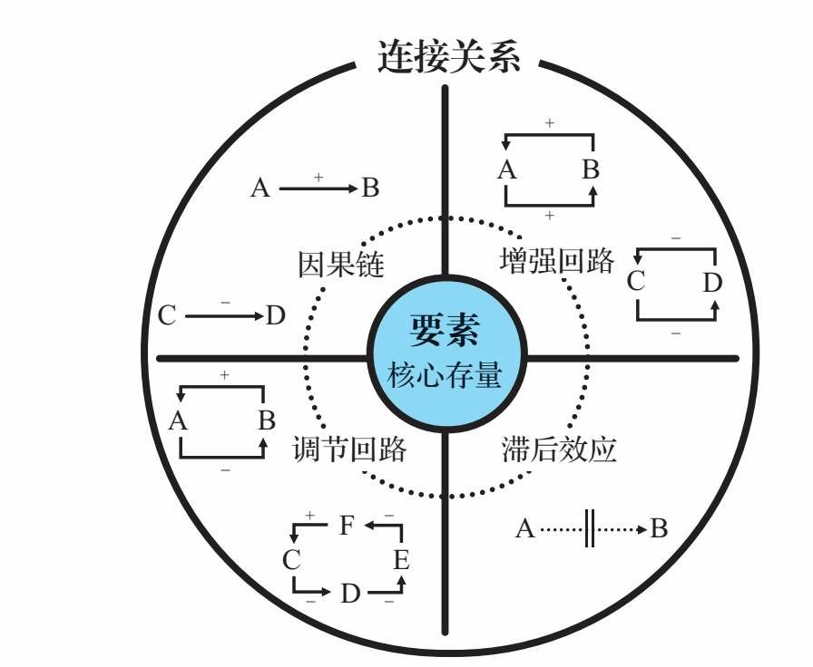
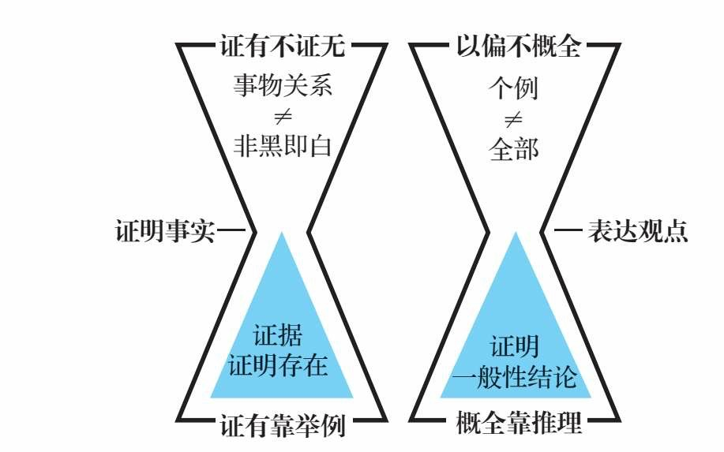
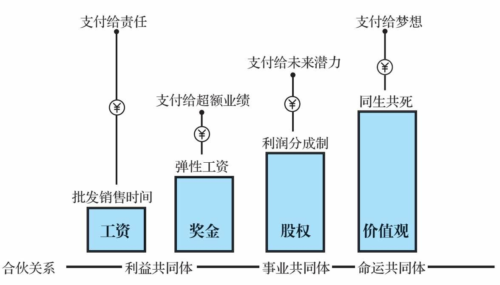
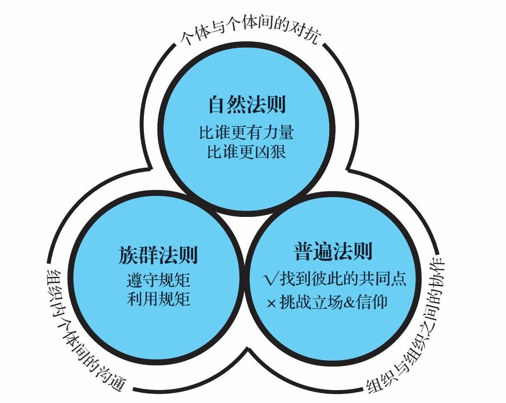
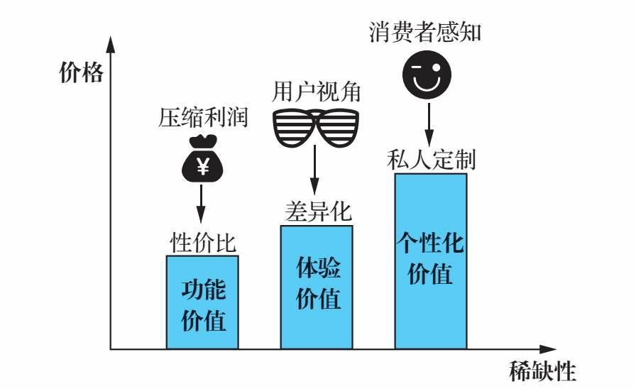
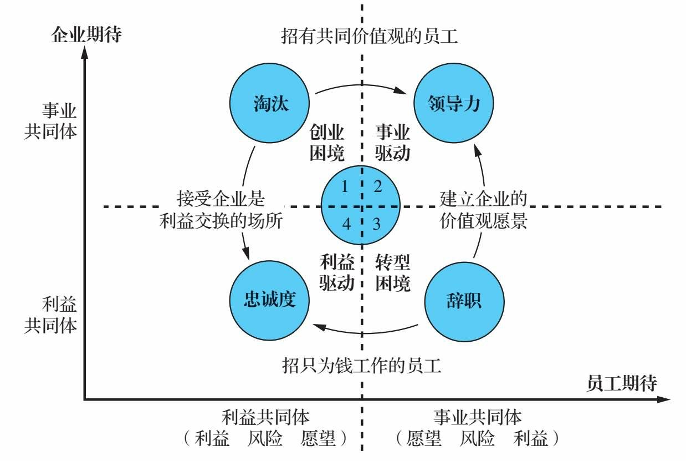

# 《底层逻辑：看清这个世界的底牌》

## 一、是非对错

### 1、对错观

一个人新书中国有三种对错观

* 法学家——谁证据确凿谁的错。使用这种对错观点的有 评论家。
* 商人——谁的损失大水的错。使用这种对错观的有 商人。
* 经济学家：谁社会总成本低谁的错。使用这种对错观的有 政策制定者。

对于普通人来说，选择做商人可能是最佳选择，应该让自己的损失最小。

### 2、人生的三层智慧

* 博弈——心态：每个人与世界进行价值交换的选择是“共赢”；策略：一报还一报，以牙还牙，以眼还眼。
* 定力——不要丢失自己的目标。最终的胜利，常常是时间的胜利，是长期主义的胜利。
* 选择——选择一个，放弃其他。勇敢选择，享受好处，承担坏处。人生的悲剧就来自什么都想要，看着前方又想着后方，最后无路可走。

人与人的差距就来自于拥有什么层次的智慧。

## 二、思考问题

### 1、事实、观点、立场、信仰

* 事实——独立于人的判断，客观存在
* 观点——对事情的看法
* 立场——被位置和利益影响的观点
* 信仰——内部完全自洽的逻辑体系

“我们不争对错，只争输赢”。所以，不要和有立场的人争对错。这也是我们常说的“小孩子才谈对错，成年人只谈利益”。

每个人都有自己的信仰，不要攻击别人的信仰。因为，第一，你不可能获胜；第二，你会失去这个朋友。

### 2、防止“注入式洗脑”

“为什么”，是“黄金三问”（Why、What、How）里最有力量、最有可能触及灵魂的问题，但也是最危险的问题。当你开始为它找原因的时候，这个观点就已经悄悄地被“注射”进你的大脑了。&#x20;

* 狡猾的人，用这个句式注射别人。你想把什么想法注射到别人脑中，把它放在“为什么”这三个字后面，就可以了。
* 狡猾的人，用这个句式注射别人。愚蠢的人，却用这个句式注射自己。

### 3、普通和优秀的差距

普通人只能看到事物的现象，而优秀的人总能透过现象看到事物的本质。

在遇到问题和困难的时候，可以采用“假设—验证—结论—调整”的方法。


就事论事，不要被立场左右。


### 4、快速洞察本质

构成系统的五种模块：变量、因果链、增强回路、调节回路和滞后效应。其中，变量是“要素”；因果链、增强回路、调节回路和滞后效应，是四种“连接关系”

<figure><figcaption></figcaption></figure>

分析问题的时候，记住五个关键步骤：&#x20;

1. 找到核心存量
2. 找到关键因果链
3. 找到增强回路
4. 找到调节回路
5. 考虑滞后效应。

### 5、流程、制度、系统

#### a、流程

我们做任何一件事都是有流程的，区别只不过是有些流程是被设计过的，有些流程是自发的，有些流程是被优化的，有些流程是低效率的。

#### b、制度

制度就是做一件事的行为准则，它可以是权力机构发布的规定，也可以是一种契约。

企业之所以制定这些制度，不是因为它们能使公司获得成功，而是为了避免公司出现大事故。

#### c、系统

系统就是若干部分相互联系、相互作用形成的具有某些功能的整体。

**普通的人改变结果，优秀的人改变原因，顶级优秀的人改变模型。改变制度是改变结果，改变流程是改变原因，改变系统则是改变模型。**

### 6、逻辑思维

<figure><figcaption></figcaption></figure>

## 三、个体进化

### 1、人生的商业模式=能力x效率x杠杆

杠杆有：团队杠杆、产品杠杆、资本杠杆、影响力杠杆

### 2、人脉

本质：给予价值、平等交换

#### 3、个人和企业的关系

<figure><figcaption></figcaption></figure>

## 四、理解他人

### 1、解决了Why，What和How才真正有意义

### 2、幽默是溢出的智慧

### 3、所谓洞察本质，就是会打比方

### 4、边界感的本质，是对所有权的认知

关系再好，也不能越界；守住边界

## 五、社会协作

## 1、三大法则和适用场景

<figure><figcaption></figcaption></figure>

### 2、战略势能

#### a、产品价格

<figure><figcaption></figcaption></figure>

#### b、利润来自没有竞争

任何一个行业，所有的红利最终都会被竞争拉平，最后大家只能赚社会工资。这时候，只能通过创新来创造利润空间。

### 3、管好公司

#### a、没有KPI，也能管好公司

优秀的人不用管理，他们会自我驱动。

胜则举杯欢庆，败则拼死相救。

#### b、只招成年人

小孩子才发脾气，成年人要做的不是抱怨，而是自己动手解决问题。成年人就是那些清楚地知道自己要什么，并且愿意为之付出努力的人。他们有很强的自驱力，渴望和优秀的人一起做有挑战的事，并且清楚自己和公司是平等的契约关系。

#### c、没有后顾之忧的人，才能发挥最大的创造性

最有创造力的工作，一定来自热爱，来自他内在的自驱力和创造性。脑子里天天想着钱的人，是干不出漂亮事的。

你要相信人性的善，人不是靠激励做事的，人自身就有成长的动力。一个人觉得安全了，不用为钱发愁了，他反而会去做一些真正有价值的事情。 德鲁克说，管理就是最大限度地激发他人的善意，我们要把员工内心的善意激发出来，而不是把他的恶意激发出来。

#### d、让优秀的人成为事业合伙人

#### e、企业和员工的相互期待

<figure><figcaption></figcaption></figure>

#### f、财富分配

致富的本质，并不是创造财富，而是分配财富。创造财富靠能力，而分配财富靠稀缺。

谁掌握稀缺资源，谁就拥有财富分配权。

#### g、信用，比黄金值钱，比性命还贵

#### h、公平、公正、公开

初次分配负责效率，再分配负责公平。
